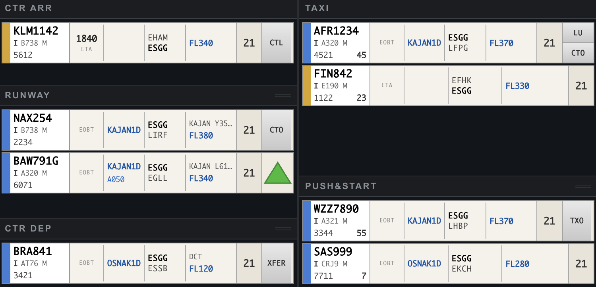
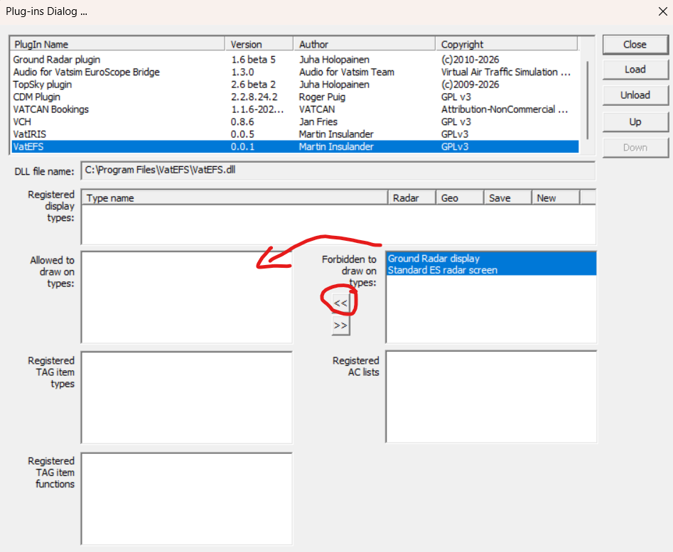

# VatEFS

An EFS (Electronic Flight Strip) application for VATSIM with EuroScope, for
ESAA (Sweden) FIR use only for now.

Work in progress, experimental software, use at your own risk, yadiyada...



## Instructions for controllers

1. Install the `.msi` package.
2. In EuroScope: **OTHER SET** → **Plug-ins…** → load `C:\Program Files\VatEFS\VatEFS.dll`.
3. Allow the plugin to draw on the radar screen.


4. Connect to VATSIM, then type `.efs start`. You should get a message from VatEFS with a link.
5. Open that link in a web browser (port 17770). On the same PC, `http://localhost:17770/` works too.

## Building & Running

Run with mock data:
```sh
cd backend
npm start -- --mock
cd ../frontend
npm start
```

To be able to reach the frontend from another device:
```sh
npm start -- --host
```

Some other options:
```sh
# Online mode - airports discovered from EuroScope's rwyconfig
npm start

# Mock mode - defaults to ESGG
npm start -- --mock

# Offline mode with specific airport(s)
npm start -- --airport ESGG
npm start -- --airport ESGG,ESSA,ESMS

# Combined with other options
npm start -- --mock --airport ESSA --callsign ESSA_TWR
```

Run backend with recording:

```sh
cd backend
npm start -- --airport ESGG --callsign ESGG_TWR --record ./logs/esgg.log
```

Stop, rerun without recording:

```sh
npm start -- --airport ESGG --callsign ESGG_TWR
```

Playback:

```sh
npm run playback -- ./logs/esgg.log --speed 2.0
```

## Contributing

Heck yeah, if you wanna help, go for it... make issues or pull requests or whatever you fancy.
